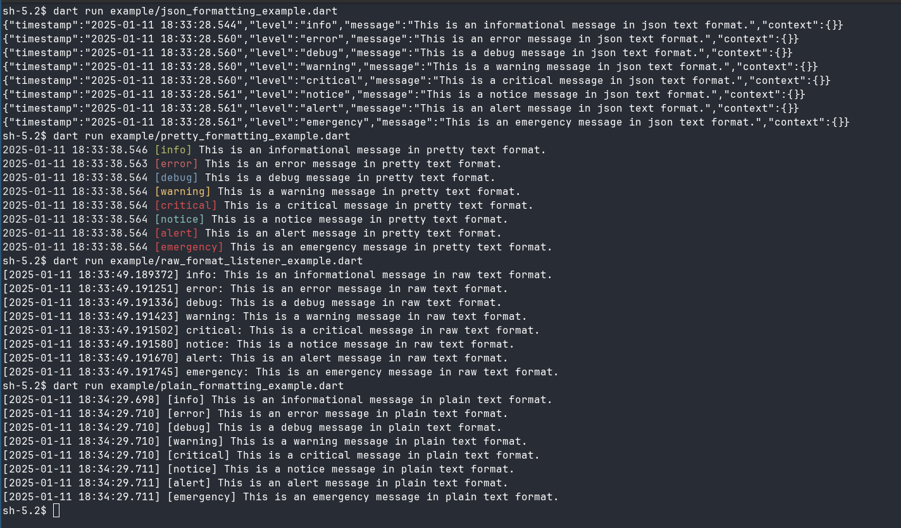

[](https://pub.dev/packages/contextual)
[](https://github.com/kingwill101/contextual/actions)

# Contextual

A structured logging library for Dart



## Features

- 🪵 **Multiple Log Levels** - From debug to emergency following RFC 5424
- 🎨 **Flexible Formatting** - JSON, plain text, and colored output
- 📊 **Rich Context Support** - Add structured data to your logs
- 🔄 **Middleware** - Transform and filter log messages
- 📤 **Multiple Outputs** - Console, files, webhooks, and more
- 🎯 **Type-specific Formatting** - Custom formatting for your data types
- ⚡ **Async & Batching** - Efficient log processing
- 🔀 **Per-Channel Formatters** - Customize formatting for each channel

## Installation

Add `contextual` to your `pubspec.yaml`:

```yaml
dependencies:
  contextual: ^1.0.0
```

## Quick Start

```dart
import 'package:contextual/contextual.dart';

void main() {
  // Create a logger
  final logger = Logger()
    ..withContext({'app': 'MyApp'});

  // Basic logging
  logger.info('Application started');
  logger.debug('Configuration loaded');
  logger.error('Something went wrong');

  // Logging with context
  logger.warning(
    'Database connection failed',
    Context({
      'host': 'localhost',
      'port': 5432,
      'attempts': 3
    })
  );
}
```

See the [example](example) folder for detailed examples.

## Configuration
Load configuration from JSON:


```dart
final config = LogConfig.fromJson({
  'channels': {
    'console': {
      'driver': 'console',
      'env': 'development',
      'formatter': 'pretty' // Use the pretty formatter for console channel
    },
    'file': {
      'driver': 'daily',
      'path': 'logs/app.log',
      'days': 7,
      'env': 'production',
      'formatter': 'json' // Use the JSON formatter for file channel
    },
    'slack': {
      'driver': 'webhook',
      'webhookUrl': 'https://hooks.slack.com/...',
      'username': 'Logger',
      'emoji': ':warning:',
      'env': 'production',
      'formatter': 'plain' // Use the plain text formatter for Slack channel
    }
  },
  'defaults': {
    'formatter': 'plain' // Default formatter if none is specified per channel
  }
});

final logger = Logger(config: config);

```

If no configuration is provided, a default configuration will be used. The default configuration logs using the `console` driver and formats logs using the `plain` formatter. To disable the the `default` console logger, at initialization, set the `defaultChannelEnabled` value to `false` in the constructor of your `Logger` instance.

```dart
final logger = Logger(
  defaultChannelEnabled: false,);
```

## Logging Patterns
Contextual supports two patterns for handling log output:

1. Sink-based Pattern (Default)
    The default pattern uses channels, drivers, and middleware for flexible output handling.

    The logger uses a sink to handle asynchronous logging with options for batching and automatic flushing. You can configure the sink using the `LogSinkConfig` class:

    ```dart
    final logger = Logger(
      sinkConfig: LogSinkConfig(
        batchSize: 50,  // Number of logs to batch before flushing
        flushInterval: Duration(seconds: 5),  // Time interval for automatic flushing
        maxRetries: 3,  // Number of retry attempts for failed log operations
        autoFlush: true  // Enable or disable automatic flushing
      )
    );

    // ... your logging code ...

    // Ensure all logs are delivered before shutting down
    await logger.shutdown();
    ```

2. Listener Pattern

    For simpler use cases, you can use a listener similar to the logging package:

    ```dart
    final logger = Logger();

    // Set up a simple listener
    logger.setListener((level, message, time) {
      print('[$time] $level: $message');
    });

    // All logs now go to the listener
    logger.info('This goes to the listener');
    ```

    The listener pattern is simpler but doesn't support:

    - Multiple output destinations
    - Channel-specific middleware
    - Asynchronous batching
  
Choose the pattern that best fits your needs:

- Use the sink pattern for production systems needing multiple outputs.
- Use the listener pattern for simple logging during development.


## Log Levels

Supports standard RFC 5424 severity levels:


```dart
logger.emergency('System is unusable');
logger.alert('Action must be taken immediately');
logger.critical('Critical conditions');
logger.error('Error conditions');
logger.warning('Warning conditions');
logger.notice('Normal but significant condition');
logger.info('Informational messages');
logger.debug('Debug-level messages');

```

## Formatters
Choose from built-in formatters or create your own. You can set formatters per channel to customize the output for each logging destination.

### Setting Formatters Per Channel


```dart
final logger = Logger()
  ..environment('development')
  ..withContext({'app': 'MyApp'})
  
  // Console channel with PrettyLogFormatter
  ..addChannel(
    'console',
    ConsoleLogDriver(),
    formatter: PrettyLogFormatter(),
  )
  
  // File channel with JsonLogFormatter
  ..addChannel(
    'file',
    DailyFileLogDriver('logs/app.log', retentionDays: 7),
    formatter: JsonLogFormatter(),
  );

// Logs sent to 'console' will be pretty-printed
// Logs sent to 'file' will be in JSON format
```

If no formatter is specified for a channel, the logger's default formatter is used.


### Using Built-in Formatters


```dart

// Set the default formatter for the logger
logger.formatter(PlainTextLogFormatter());

// Choose from the built-in formatters
logger.formatter(PrettyLogFormatter()); // Colorful, human-readable
logger.formatter(JsonLogFormatter());    // JSON format
logger.formatter(RawLogFormatter());     // No formatting

// Set formatter per channel in configuration
final config = LogConfig.fromJson({
  'channels': {
    'console': {
      'driver': 'console',
      'formatter': 'pretty'
    },
    'file': {
      'driver': 'daily',
      'path': 'logs/app.log',
      'formatter': 'json'
    }
  }
});
```

### Custom Formatters

Create custom formatters to have full control over log output:

```dart
class MyCustomFormatter extends LogMessageFormatter {
  @override
  String format(LogLevel level, String message, Context context) {
    // Your custom formatting logic
    return '[Custom] $level: $message';
  }
}

// Register the custom formatter
logger.registerFormatter('custom', () => MyCustomFormatter());

// Assign the custom formatter to a channel
logger.addChannel(
  'myChannel',
  ConsoleLogDriver(),
  formatter: MyCustomFormatter(),
);

```

### Type-specific Formatting
Create custom formatters for your data types:

```dart
class User {
  final String name;
  final String email;

  User(this.name, this.email);
}

class UserFormatter extends LogTypeFormatter<User> {
  @override
  String format(LogLevel level, User user, Context context) {
    return '{"name": "${user.name}", "email": "${user.email}"}';
  }
}

// Register the formatter
logger.addTypeFormatter(UserFormatter());

// Now User objects will be formatted automatically
final user = User('John Doe', 'john@example.com');
logger.info(user);
```


## Output Destinations
Configure multiple output destinations:

```dart
logger
  // Console output with pretty formatting
  .addChannel(
    'console',
    ConsoleLogDriver(),
    formatter: PrettyLogFormatter(),
  )
  
  // Daily rotating file with JSON formatting
  .addChannel(
    'file',
    DailyFileLogDriver('logs/app.log', retentionDays: 7),
    formatter: JsonLogFormatter(),
  )
  
  // Webhook (e.g., Slack) with plain text formatting
  .addChannel(
    'slack',
    WebhookLogDriver(Uri.parse('https://hooks.slack.com/...')),
    formatter: PlainTextLogFormatter(),
  );

// Log to specific destinations
logger.to(['console', 'file']).info('This goes to console and file');
```

## Context
Add structured data to your logs:

```dart
// Global context for all logs
logger.withContext({
  'environment': 'production',
  'version': '1.0.0'
});

// Per-log context
logger.info(
  'User logged in',
  Context({
    'userId': '123',
    'ipAddress': '192.168.1.1'
  })
);
```

## Middleware

Transform or filter logs:

  ```dart
// Add sensitive data filter
logger.addLogMiddleware(SensitiveDataMiddleware());

// Add request ID to all logs
logger.addMiddleware(() => {
  'requestId': generateRequestId()
});

// Channel-specific middleware
logger.addDriverMiddleware(
  'slack',
  ErrorOnlyMiddleware()
);
```

## Advanced Usage
### Batch Processing
Configure batching behavior:

```dart
final logger = Logger(
  sinkConfig: LogSinkConfig(
    batchSize: 50,  // Flush after 50 logs
    flushInterval: Duration(seconds: 5),  // Or every 5 seconds
    maxRetries: 3,  // Retry failed operations
    autoFlush: true  // Enable automatic flushing
  )
);
```

### Custom Drivers
Implement your own log destinations:

```dart
class CustomLogDriver implements LogDriver {
  @override
  Future<void> log(String formattedMessage) async {
    // Your custom logging logic
  }
}
```

## Channels
Channels are named logging destinations that can be configured independently. Each channel represents a different way to handle log messages:

```dart
// Configure multiple channels with per-channel formatters
final logger = Logger(
  config: LogConfig.fromJson({
    'channels': {
      // Console output for development with pretty formatting
      'console': {
        'driver': 'console',
        'env': 'development',
        'formatter': 'pretty'
      },
      // Daily rotating file for production logs with JSON formatting
      'daily': {
        'driver': 'daily',
        'path': 'logs/app.log',
        'days': 7,
        'env': 'production',
        'formatter': 'json'
      },
      // Slack notifications for critical issues with plain text formatting
      'slack': {
        'driver': 'webhook',
        'webhookUrl': 'https://hooks.slack.com/...',
        'username': 'Emergency Bot',
        'emoji': ':rotating_light:',
        'env': 'production',
        'formatter': 'plain'
      }
    }
  })
);
// Log to specific channels
logger.to(['console', 'daily']).info('Regular log message');
logger.to(['slack']).critical('Critical system failure!');

// Default behavior logs to all channels for the current environment
logger.error('This goes to all active channels');
```

## Environment-based Channel Selection
Channels can be configured to be active only in specific environments:

```dart
final logger = Logger(environment: 'production')
  ..addChannel(
    'console',
    ConsoleLogDriver(),
    formatter: PrettyLogFormatter(),
  ) // No env specified, always active
  ..addChannel(
    'daily',
    DailyFileLogDriver('logs/app.log'),
    formatter: JsonLogFormatter(),
  ) // Production only
  ..addChannel(
    'debug',
    ConsoleLogDriver(),
    formatter: PrettyLogFormatter(),
  ); // Development only

// In production: logs to 'console' and 'daily'
// In development: logs to 'console' and 'debug'
```

## Stack Channels
Stack channels allow you to create a single channel that forwards logs to multiple other channels. This is useful when you want to send the same logs to multiple destinations with different formatting and filtering:

```dart
final config = LogConfig.fromJson({
  'channels': {
    // Individual channels with their own formatters
    'file': {
      'driver': 'daily',
      'path': 'logs/app.log',
      'formatter': 'json'
    },
    'slack': {
      'driver': 'webhook',
      'webhookUrl': 'https://hooks.slack.com/...',
      'formatter': 'plain'
    },

    // Stack channel that combines both
    'production': {
      'driver': 'stack',
      'channels': ['file', 'slack'], // Will forward to both channels
      'ignoreExceptions': true
    }
  }
});

// Now you can log to both channels with one call
logger.to(['production']).error('Critical failure');
```

Stack channels are particularly useful for:

- Sending critical logs to multiple destinations
- Applying different formatting per destination
- Creating backup logging channels
- Setting up monitoring and notification systems

Each channel in a stack maintains its own middleware chain and formatter, allowing for independent processing of logs for each destination.

## Understanding Middleware
Contextual uses a two-stage middleware system to provide flexible log processing:

### Context Middleware
Context middleware runs first and can add or modify the context data before any formatting happens:

```dart
// Add request ID and timestamp to all logs
logger.addMiddleware(() => {
  'requestId': generateRequestId(),
  'timestamp': DateTime.now().toIso8601String()
});

// Add dynamic user info when available
logger.addMiddleware(() {
  if (currentUser != null) {
    return {'userId': currentUser.id};
  }
  return {};
});

// Now these fields are automatically added
logger.info('User action'); // Includes requestId, timestamp, and userId
```

### Driver and Channel Middleware
Driver middleware processes log entries before they reach specific drivers. Channel middleware works similarly but is associated with channels.

```dart
// Filter sensitive data from all logs
class SensitiveDataMiddleware implements DriverMiddleware {
  @override
  Future<MapEntry<String, String>?> handle(
    MapEntry<String, String> entry,
    String driverName,
  ) async {
    var message = entry.value;
    message = message.replaceAll(RegExp(r'password=[\w\d]+'), 'password=***');
    return MapEntry(entry.key, message);
  }
}

// Only allow errors to reach certain drivers
class ErrorOnlyMiddleware implements DriverMiddleware {
  @override
  Future<MapEntry<String, String>?> handle(
    MapEntry<String, String> entry,
    String driverName,
  ) async {
    final errorLevels = ['emergency', 'alert', 'critical', 'error'];
    if (!errorLevels.contains(entry.key.toLowerCase())) {
      return null; // Stop processing this log entry
    }
    return entry;
  }
}

// Add middlewares
logger
  // Global middleware applied to all drivers
  .addLogMiddleware(SensitiveDataMiddleware())
  // Channel-specific middleware only applied to the 'slack' channel
  .addDriverMiddleware('slack', ErrorOnlyMiddleware());

// Middleware execution flow:
// 1. Context middleware runs first
// 2. Log is formatted
// 3. Global driver middlewares process the log
// 4. Channel-specific middlewares process the log
// 5. Log is sent to the driver
```

## Asynchronous Logging and Shutdown
The logger uses asynchronous processing and batching to improve performance. This means you must properly shut down the logger to ensure all logs are delivered:

```dart
void main() async {
  final logger = Logger(
    sinkConfig: LogSinkConfig(
      batchSize: 50, // Buffer up to 50 logs
      flushInterval: Duration(seconds: 5), // Or flush every 5 seconds
    )
  );

  try {
    // Your application code
    logger.info('Application starting');
    await runApp();
    logger.info('Application shutting down');
  } finally {
    // Ensure all logs are delivered before exiting
    await logger.shutdown();
  }
}

// In a web application
class MyApp {
  final Logger logger;

  Future<void> stop() async {
    logger.notice('Stopping application');
    await stopServices();
    await logger.shutdown();
  }
}
```

The `shutdown()` method:

- Flushes any buffered log messages
- Waits for all async log operations to complete
- Ensures webhook requests are sent
- Closes file handles and other resources

Always call `shutdown() `before your application exits to prevent log message loss.


## Conclusion

Contextual provides a flexible and powerful logging solution for Dart applications. By allowing per-channel formatters, you can customize the output of each logging destination to suit your needs. Whether you're developing a simple application or a complex system with multiple output channels, Contextual offers the tools you need to implement efficient and informative logging.

## Contributing

Contributions are welcome! Feel free to open an issue or submit a pull request on [GitHub](https://github.com/kingwill101/contextual).

## License

This project is licensed under the MIT License - see the [LICENSE](LICENSE) file for details.
